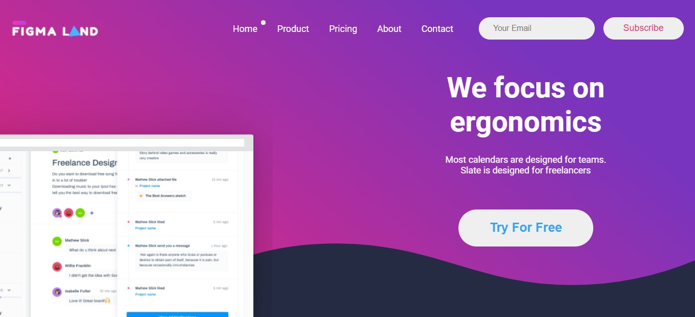
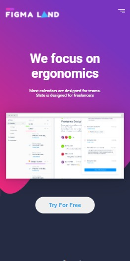

# Desafio hugedev's
> Implementado o design compartilhado no [Figma](https://www.figma.com/file/Pdd6VRN08X6kCyZlIeuWEG/Teste-Developers)

<br />

<div align="center">
  <a href="https://www.linkedin.com/in/higordenomar/">
    
  </a>
  
  <a href="https://twitter.com/higordenomar">
    
  </a>

  <a href="mailto:higordenomar@hotmail.com">
    
  </a>
  <br><br>
</div>

A Landing page foi construída utilizando [React.js](https://pt-br.reactjs.org/) e estilizada com [Styled Components](https://styled-components.com/docs/basics).

</br><br/>

## 📷 Screenshots



<br />



<br/><br/>

## 💻 Instalação


```sh
# Clone este repositório (requer o git instalado):

> git clone https://github.com/HigorDenomar/frontend-teste.git


# Vá para o diretório do projeto:

> cd frontend-teste


# Instale as dependência (requer o node.js instalado):

> npm install


# inicie o projeto:

> npm start
```
O site irá abrir em http://localhost:3000

</br></br>
<i>Code By [Higor Denomar](https://github.com/HigorDenomar)</i>